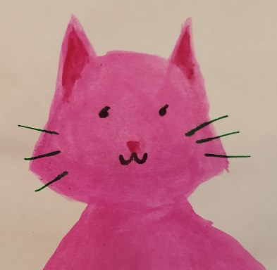
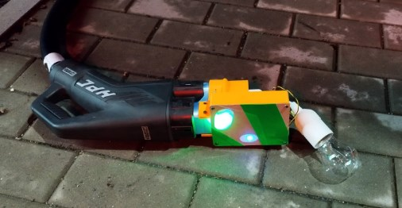
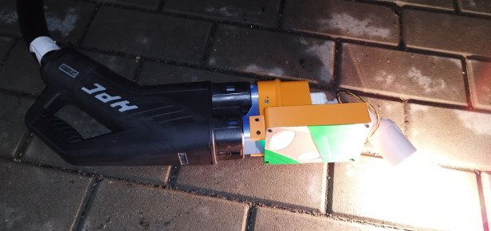

# ccs32clara

 Hi, I'm Clara. I'm a piece of software, which was born in the OpenInverter forum community, https://openinverter.org/forum/viewtopic.php?t=3727, and I'm loving to grow due to the great people there.
Im running on an STM32, and I'm talking with a QCA7005 homeplug modem. All this, and some more components, brings my team-mate Foccci to you. Foccci is the hard(-ware) part of our powerful team. Let's charge!

## News / Change History / Functional Status

### 2024-01-24 Mini Light Bulb Demo adaptor works
Clara configured to demo-mode using the openinverter web interface box (https://github.com/jsphuebner/esp32-web-interface). Clara runs on Foccci in a 3D printed housing, which contains a CCS2 inlet, a German SchuKo outlet, a relay to connect/disconnect the Schuko from the CCS, red-green-blus LEDs for status indication, a stop-button and D-Sub CAN connector, a little arduino to show the hardware status of the CP line (https://github.com/uhi22/arduino-controlpilot-observer) and a 18650 Li-Ion accu including step-up from accu to 5V to supply the complete box.

### 2023-12-13 Supercharging works.
Johu is charging the Touran on the TESLA Supercharger: https://openinverter.org/forum/viewtopic.php?p=64563#p64563 and https://www.youtube.com/watch?v=OKg3VUslol8

### 2023-12-06 Charging works on ABB triple charger and Compleo
The liboi port has been tested inside the CCS-to-CHAdeMO adapter and successfully charged a few kWh on said chargers

### 2023-08-03 Charging works on public Alpitronic charger

With the STM32F103RE on the Foccci board, the light-bulb-demo-charging on Alpitronic hypercharger worked on the first attempt.
Pictures here: https://openinverter.org/forum/viewtopic.php?p=59821#p59821

### 2023-07-18 Charging loop reached

Using the NUCLEO F303RE development board, the STM32 talks via SPI to the QCA7005 on the Ioniq CCM. The ccs32clara reaches the charging
loop, and shows the charging progress on the serial console in the Cube IDE.

## Todos
- [x] Implement TCP retry to compensate for single lost packets
- [ ] Takeover latest state machine updates from pyPLC
- [x] Control the CP line and the contactor outputs
- [x] Add CAN
- [x] Migrate to STM32F103RE, which is planned for the foccci board
- [ ] (much more)

## Build Environment / Compiling

- arm-none-eabi-gcc
- Controller: STM32F103RE
- Installation of tool chain and flashing [Clara User Manual](doc/clara_user_manual.md)

## Cross References

* The Hyundai Ioniq/Kona Charge Control Module (CCM): https://github.com/uhi22/Ioniq28Investigations/tree/main/CCM_ChargeControlModule_PLC_CCS
* The ccs32berta "reference project" (which uses an ESP32, talking via SPI to a QCA7005: https://github.com/uhi22/ccs32berta
* The ccs32 "reference project" (which uses ethernet instead of SPI, hardware is an ESP32 WT32-ETH01): https://github.com/uhi22/ccs32
* Hardware board which integrates an STM32, QCA7005 and more: https://github.com/uhi22/foccci
* pyPLC as test environment: https://github.com/uhi22/pyPLC
* Discussion on openinverter forum: https://openinverter.org/forum/viewtopic.php?t=3727
* Similar project discussed on SmartEVSE github: https://github.com/SmartEVSE/SmartEVSE-3/issues/25#issuecomment-1608227152
